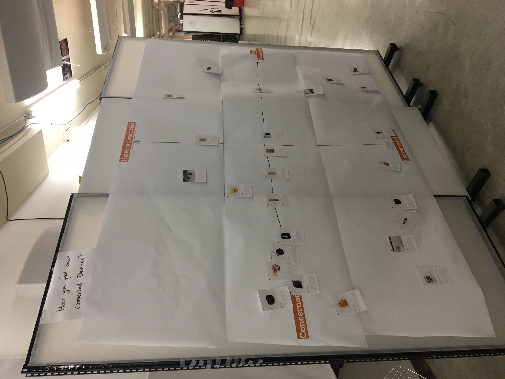

# Day 1 activities

## CPG briefing

In a very clear, direct way, brief your audience on your community participation guidelines, which might also be known as a code of conduct, participation guidelines, or a friendly or safe space policy. Answer any questions audience members have about the guidelines.

Then share practical safety tips, like signaling for explanation when someone uses jargon or signalling for a break or stop when things are too intense.

Finally, make sure people know where to go if they need a restroom or to use a fire exit in an emergency.

## Perform the Net

**Materials:** crafting supplies, game pieces, minifigs, tape, string, scissors, paper, markers

- Ask learners, "How do you get to the Internet?" Take a few ideas from the group, then explain the following:

  The "Internet" is a system of networks and the "Web" sits on top of the Internet and provides an interface for viewing and interacting with the information stored in various computers around the world.
  
- Further explain that:

  Anytime you ask the Internet to do something, whether by entering a URL into a browser or watching a video on YouTube, your internet request "hops" through several network devices, like routers and switches and servers, on its way from your computer to the website’s server.
  
- Watch this introductory video (also linked from this picture) to give learners a little more context before starting the obstacle course:

  https://www.youtube.com/watch?v=ewrBalT_eBM 

- Then deliver these instructions:

  Form small improv groups of 4-5 actors. Get together and brainstorm a way to perform how the Internet works. Think about how to use your space - you can perform anywhere there's room in the space around you and spread out and move around as much as you'd like. Think about the materials around you and grab any props that might help you show the Net at work.
  
- Perform your skits for one another. Applaud your heart out for the other groups. Laugh and cheer at especially great moments of Performing the Net history!

## Gigabit activity: sticky note art

**Materials:** sticky notes

- Introduction:
  - Now that we know how the internet works, let’s explore the difference of high-speed internet networks.
  - In the video we learned that the internet is about passing packets of information back and forth around the globe. In this activity, our packets were represented by post-it notes.

- Instructions:
  - The room divides into two groups (or more, depending on size).
  - Each group is given 30 post-it notes
  - Give them 5 minutes to create a sticky note art masterpiece.
  - The group then forms a line from the back wall up to the front wall (or sticky note pad and easel).

- **Round 1:** Each group is allowed to pass 1 sticky note at a time up to the front and recreate their masterpiece.
  - Time them.

- **Round 2:** Each group can pass 5 sticky notes at a time up to the front and recreate their masterpiece.
  - Time them

- **Reflection:** What did you learn? What stood out to you about this? Was it any it new?
 
- **Facilitation tips:**
  - The group that was only allowed to pass one post it note at a time is like traditional internet, sending one packet at a time. The other group was like a gigabit network and was able to send many more packets of information in the same amount of time.
  - But gigabit internet isn’t just five times faster than traditional networks - it’s 18 times faster to download and 52 times faster to upload than the average connection in an American home.
  - In fact, gigabit internet allows for upload and download speeds of 1000 Mbp/s. That means you can download an entire two hour movie in a little under two minutes, or simultaneously watch five high-definition cat videos and still have enough bandwidth to check email and browse the web at the same time.
  - Library metaphor - using a library card to check out a book one page at a time compared to a card being able check out the entire book at once.

## Privacy & security spectrogram

**Materials:** sticky notes, markers

- Welcome everyone and explain that you are about to start with a short introductory activity.
- Ask everyone to stand up and clear space in the room so they can move around without bumping into any obstacles.
- Place post-its with the numbers one to ten written on them in a line on the floor or wall. Leave enough space for people to separate along the line.
- Explain the activity to the participants: You will read a statement and if they completely agree with that statement, they should stand near the number 10. If they completely disagree, they should stand near the number 1. Those who somewhat agree would stand at number 5. Tell the participants that they can change their minds based on what other participants say.
- Potential prompts:
  - It’s okay to lose privacy if you have nothing to hide.
  - It’s my personal responsibility to understand and use privacy settings.
  - It’s businesses’ responsibility to make privacy the default on their products.
  - I understand how the devices in my room collect data and where they send it.
  - I understand how my personal devices collect data and where they send it.
  - My devices can’t be used to jeopardize anyone’s security. 
  - Government should be able to see what’s on all of our devices at any time.
  - Collecting metadata about me - or general information about whom I call, where I go, and where I go online -  isn’t a big deal or invasion of privacy.

**Resource you can share:** "The House That Spied on Me," https://gizmodo.com/the-house-that-spied-on-me-1822429852?rev=1518027891546 

## IoT activity

**Materials:** a large wall space or floor space to lay all of the cards and map out, wall matrix map, Chattanooga map/support probes, *privacy not included cards, sharpies/pens, blue tac

- There are 2 parts to the activity. 
  - **Part 1:** We’ll map out how people feel about different types of Internet of Things (IoT) devices on a large wall. Each participant will get 2 cards describing connected devices in the *privacy not included guide. Then each participant will place their cards on the wall relative to 2 axes. The vertical axis will run from "I don't want this" to "I want this," and the horizontal axis will run from "I am concerned" about this device to "I am not concerned." Then participants will be have the opportunity to vocalize which devices they put where and to discuss the trade-offs in each that create tensions between convenience and privacy.

  
  
  - **Part 2:** We'll explore the city around our workshop site looking at the different internet touchpoints and imagining about future interactions we could have here. After we get back together in our workshop space, we'll share what we saw, what we imagined for the future, and perhaps add some of the devices we saw or imagined to our matrix of desirability and concern.
  

## Design deck activity

**Materials:** design decks, canvases

- We’ll use this design deck to learn about designing IoT prototypes.
- The deck helps us identify problems, design for users, and develop possible solutions.
- These cards will give us problems called scenarios, users called personas, and possible solutions called technologies.
- We’ll use a “canvas,” or organizer, to capture how we think we can help this person solve a problem with this technology.
- You can mix and match and try again - big idea is to practice design thinking in a fun, social, collaborative way, not have the perfect answer.
- We’ll have time for 2-3, the share our favorite with the whole group.
- Let’s count off by 4s to create groups and begin our designs.

## Intro to the escape room challenge

**Materials:** paper prototyping supplies (e.g. paper, cardboard, hot glue?, scissors, markers, etc.)
Ask for audience explanations and stories to activate prior knowledge, share expertise.

- Share possible escape room clip(s) to build common understanding.
  - https://www.youtube.com/watch?v=zA64Q24IiW8 
  - https://www.youtube.com/watch?v=eYVOYcF9Gl0 
  - https://www.youtube.com/watch?v=ffPAk0yCx8Q 
- Optional: share possible Crystal Maze clip(s) to build common understanding.
  - https://www.youtube.com/watch?v=N9H6Fr_wh90
  - https://www.youtube.com/watch?v=mRiIg8q4vAw 
- Optional: share possible BreakoutEdu clip(s) to build common understanding.
  - https://www.youtube.com/watch?v=_fSdiKin5q0
  - https://www.youtube.com/watch?v=QWSoR-0DH8Q
  - https://www.youtube.com/watch?v=LXThBIdCemg 
- Share hallmarks of a good escape room.
  - A social, collaborative game.
  - A room full of related puzzles and clues.
  - A time based challenge.
  - A great story.
  - A consistent theme.
  - Logical puzzles.
  - Lots of small achievements.
  - A manageable group size.
  - A 45- to 60-minute experience.
  - A high win percentage (60-70%).
- Explain our challenge
  - We need to create the story, prototype props, and instructions for an escape room that teaches people about privacy & security on the Internet of Things. Our players should be able to escape the room by practicing healthy privacy & security habits and defeating puzzles about privacy & security. 
  - Our goal is to finish with a rough kit other people can take, use, and adapt to teach their communities about privacy & security and connected devices.
  - We can each contribute in different ways. Some are technical; others are not.
  - Our room may be a small set, a series of demos or puzzles, or a gallery walk.
  - We will decide on a theme together and begin writing and building our room.
  - We will share what we have with the public tomorrow afternoon.

## Forming groups

Invite participants to form groups according to the comfort levels and interest in designing and building the group's IoT escape room.

For example, we set up 4 stations for groups like these:

- **Documentation:** Create the facilitation materials needed to run a workshop like this one.
- **Storytelling:** Develop the story of the escape room and help the prototyping groups create puzzles that fit within it.
- **Paper prototyping:** Use paper, cardboard, cardstock, glue, and other materials to crate puzzles that model different kinds of IoT interactions and issues without needing to build or code soemthing like a circuit or script.
- **Device Prototyping:** Use available protyping materials such as paper circuitry supplies, arduinos, Raspberry Pis, and other electronics supplies to create puzzles that fit within the room's narrative and encourage participants to ask questions about their privacy and sucrity on conncted devices.

Our hope was to differentiate in a way that allowed everyone to find a role in the project that felt fulfilling and gave them a concrete way to contribute to the work.

Other instances of the workshop might also group participants by puzzle or any other facet of the design or escape room experience.