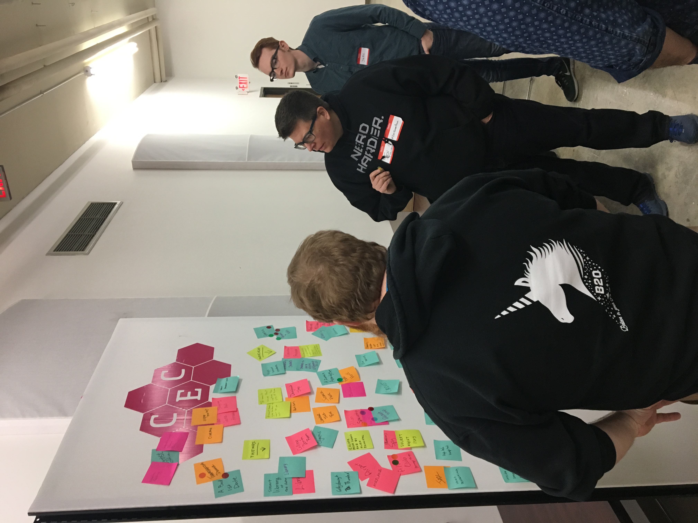

# Day 1 methods

## Decide on a theme and audience

- Silent brainstorm: everyone writes down ideas for themes (or settings) and audiences on sticky notes. This could also be done on a shared document.
- Sharing: everyone posts their sticky notes on a common surface like part of a wall or a large sheet of poster paper. Participants can skip this step if they're working on a shared document. (5 minutes)
- Grouping: volunteers sort and group themes and audiences that are alike. This can be done with cutting and pasting on a shared document.
- Briefing: the volunteers who sorted the sticky notes explain each theme and audience cluster to the whole group. Participants can ask questions to clarify the ideas on the notes and in the clusters. Participants can review the groupings on their own in a shared document.
- Dot voting: Participants each get 2 small "dot" stickers - one to vote for a favorite theme and another to vote for a favorite audience.  Participants can do this with +1 comments or edits on a shared document.
- Setting a theme and audience: Event organizers tally the votes and announce the theme and audience, making sure that all participants are comfortable with the results.

