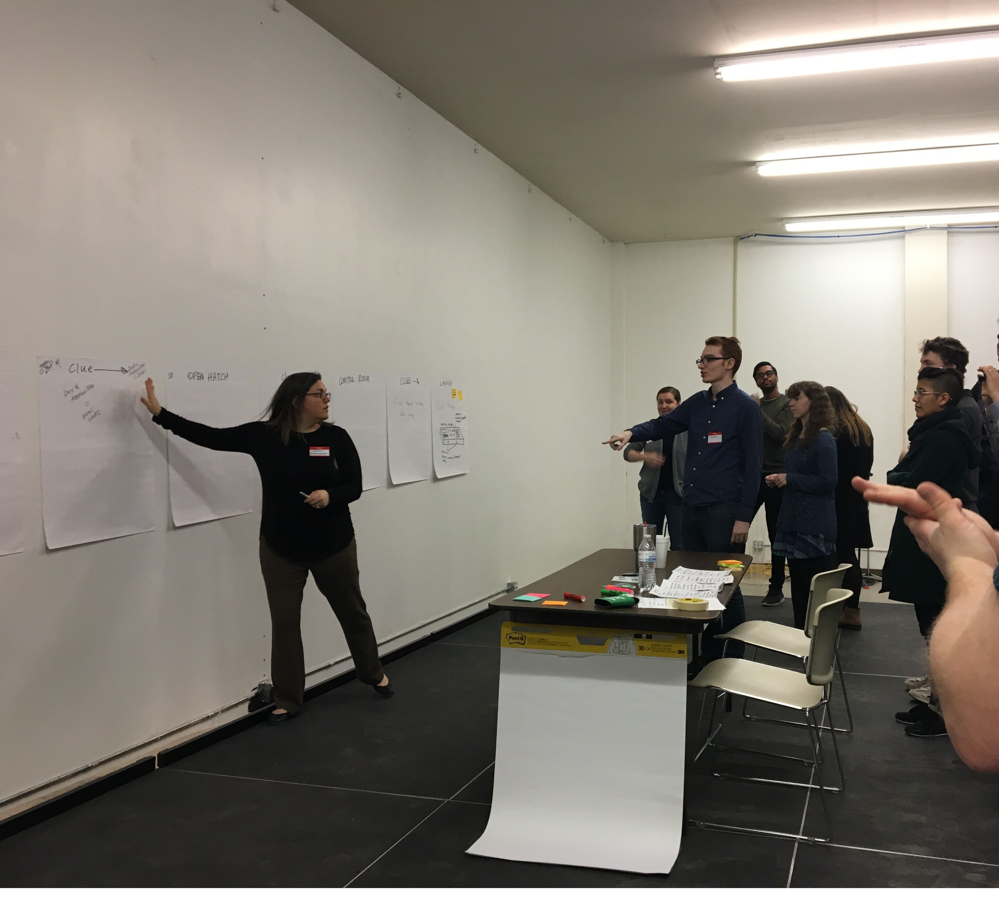
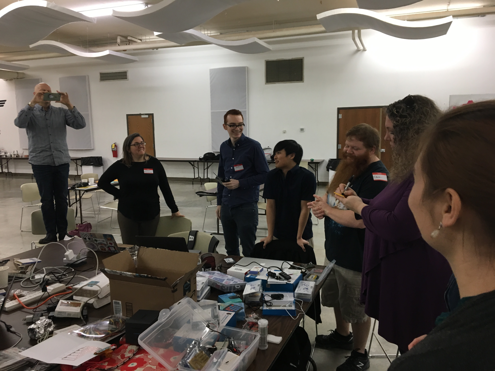
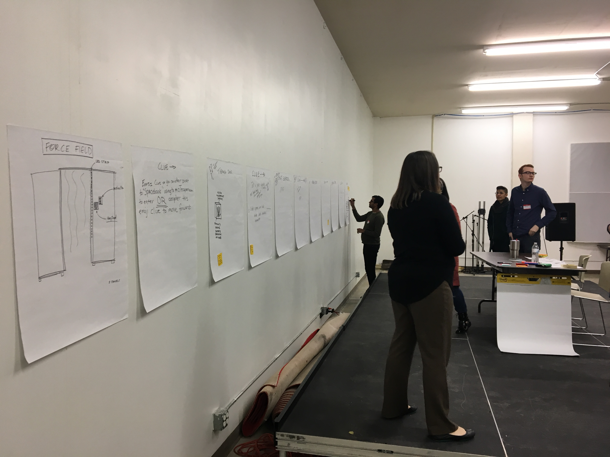
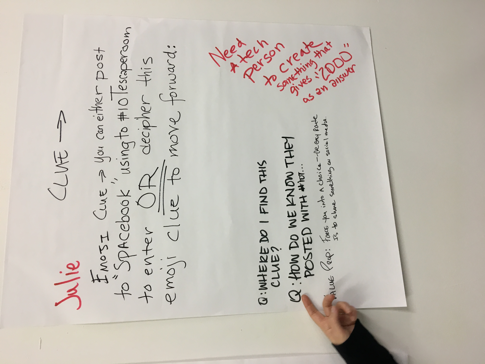
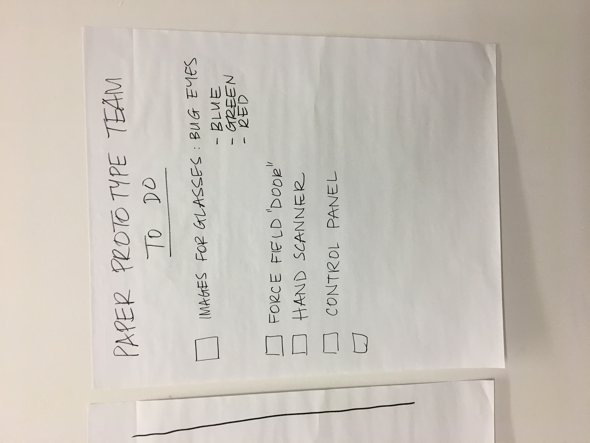

# Day 2 methods

## Check-ins

You should begin work time on day 2 with a check-in.

Check-ins are frequent, brief whole-group meetings during which representstives from each "team" share their work with the rest of the participants. Everyone attends, but only a few people from each team need to speak each time.

 

The big idea is to keep participants working together and to make sure each group has what it needs from the others. For example, the storytelling group and prototyping groups need to understand each other's work to create a cohesive story, as well as to make sure each puzzle inspires people to ask themselves about privacy and security on the Internet of Things.

It's a good idea to have your group facilitators invite and encourage new speakers for each check-in and to have those facilitators coach and otherise support their speakers. Speakers should be voluntary, though; no one should be amde uncomfortable by having to speak at a check-in.

At the end of each check-in, announce a time for the next one.

## Ways to use check-ins

### Tech demos

You can use one check-in meeting to run through several tech demos early on day 2, or else share just 1 or 2 tech demos as part of several check-ins on the morning of day 2. However, the earlier the group starts imagining the possibilities, the better.

 

Tech demos are brief explanations of the technology and interactions available at your event so that everyone on each team can get inspired and share ideas about how to use those supplies. 

Tech demos can be done spontaneously or recorded before an event and shown on a screen or shared online.

Each demo should be short. For example, a tech demo of a light sensor might go like this: "This is a light sensor. We can use it to activate a device or unlock something. We can use it to fake or just model other sensores like fingerprint or retina scanners, too."

After each demo, invite participants to share a few ideas about how that technoligy might be used in the story or as part of a puzzle within it.

Here are several example videos that show what a device can do very quickly.

- [Speech to light](https://www.youtube.com/watch?v=fMqJ0g99LHM&feature=youtu.be)
- [Fake retina scanner](https://www.youtube.com/watch?v=I-Maj5vm-Cw&feature=youtu.be)
- [Fake fingerprint scanner](https://www.youtube.com/watch?v=bOQEH0nSFQ0&feature=youtu.be)
- [Servo that reveals something](https://www.youtube.com/watch?v=h9NrLpvzNl0)
- [Sensor that triggers sound](https://www.youtube.com/watch?v=1m3NCY2ShHE&feature=youtu.be)

### Storyboarding

You can use check-ins to share the storytelling team's plan for the escape room and to map other team's tasks to that story.

The storytelling team should create a general storyboard for the escape room using large pieces of poster paper that they can put up in order on a wall of your event space.

 

Each piece of paper should have:

- The title for 1 device or part of the escape room.
- A skecth of that device or part of the escape room showing how it works.
- A brief description or explanation of what happens with the device or part of the escape room.
- A question about privacy and security on connected devices that the device or part of the escape room should make people ask themselves.

 

The documentation group can then use the storyboards to plan what they need to capture from the event, and the prototyping groups can identify specific devices to design and build for the escape room.

### To-do lists

Once teams have been able to share updates, tech demos, and storyboards, the group can create to-do lists to assign specific tasks to specific participants or teams.

 

The list should be on one or more pieces of poster paper hung up in an easily accessible part of your event space.

These assignments can become a simple to-do list that the group keeps track of and updates during each check-in, or they can become something more sophisticated like a scrum board to show who is doing what and which tasks have yet to be done, which tasks are being worked on right now, and which tasks are already complete.

One of your facilitators can take primary responsibility for the to-do list, but the whole group should be able to access it to take on tasks and mark off those participants complete.